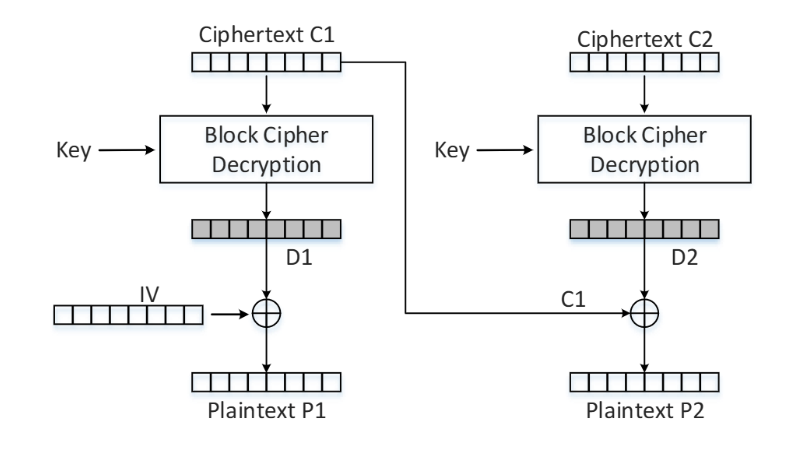

# Padding Oracle Attack — Applied Cryptography Project

> A practical study of the **Padding Oracle Attack** against CBC-mode block ciphers, run inside a Dockerized lab. Demonstrates how an oracle that only reveals whether decryption padding is valid is enough to decrypt arbitrary ciphertext.



Built for the **Applied Cryptography** course at Birzeit University, supervised by **Prof. Ahmad Alsadeh**. The lab uses the SEED Labs Padding-Oracle environment to host two vulnerable services (ports 5000 and 6000) and exercises both manual byte-by-byte recovery and a fully scripted attack.

---

## Tech Stack


---

## Highlights

- **Block-level CBC analysis** — exploits the PKCS#7 padding check to recover one byte at a time, starting from the last block.
- **Dockerized lab environment** — `Labsetup.zip` ships the vulnerable services so the attack is reproducible in a sandboxed container.
- **Manual + automated attack scripts** — three tasks of increasing scope, each with its own captured port log.
- **Defensive perspective** — concludes with mitigations: authenticated encryption (AES-GCM), constant-time padding checks, and avoiding oracles that distinguish padding errors from generic decryption failures.

---

## Repository Layout

```
.
├── README.md
├── Crpto project.docx          # Full written report
├── ProjectCrpto1200105.pdf     # Submitted PDF report
├── Crypto_Padding_Oracle.pdf   # Reference reading
├── Labsetup.zip                # SEED Labs Docker environment
├── code of task two.txt        # Task 2 attack code (port 5000)
├── CodeOfTask3.txt             # Task 3 attack code (port 5000 / 6000)
├── Task 2 port 5000.txt        # Captured output — task 2
├── Task 3 port 5000.txt        # Captured output — task 3 / port 5000
├── Task 3 port 6000.txt        # Captured output — task 3 / port 6000
└── docs/
    └── showcase.png            # CBC decryption diagram
```

---

## How to Reproduce

1. Install Docker and `docker-compose`.
2. Unpack `Labsetup.zip` and launch the lab:

   ```bash
   unzip Labsetup.zip
   cd Labsetup
   docker compose up -d   # or: dcup
   ```

3. Run the task scripts. The Python source in `code of task two.txt` and `CodeOfTask3.txt` can be saved as `.py` files and executed:

   ```bash
   python3 task2.py       # targets http://localhost:5000
   python3 task3_5000.py
   python3 task3_6000.py
   ```

The PDF report walks through the byte-recovery logic, the impact of the IV, and the concrete fixes.

---

## Course & Acknowledgements

- **Course:** Applied Cryptography, Birzeit University
- **Supervisor:** Prof. Ahmad Alsadeh
- **Lab base:** [SEED Labs — Padding Oracle Attack](https://seedsecuritylabs.org/)
